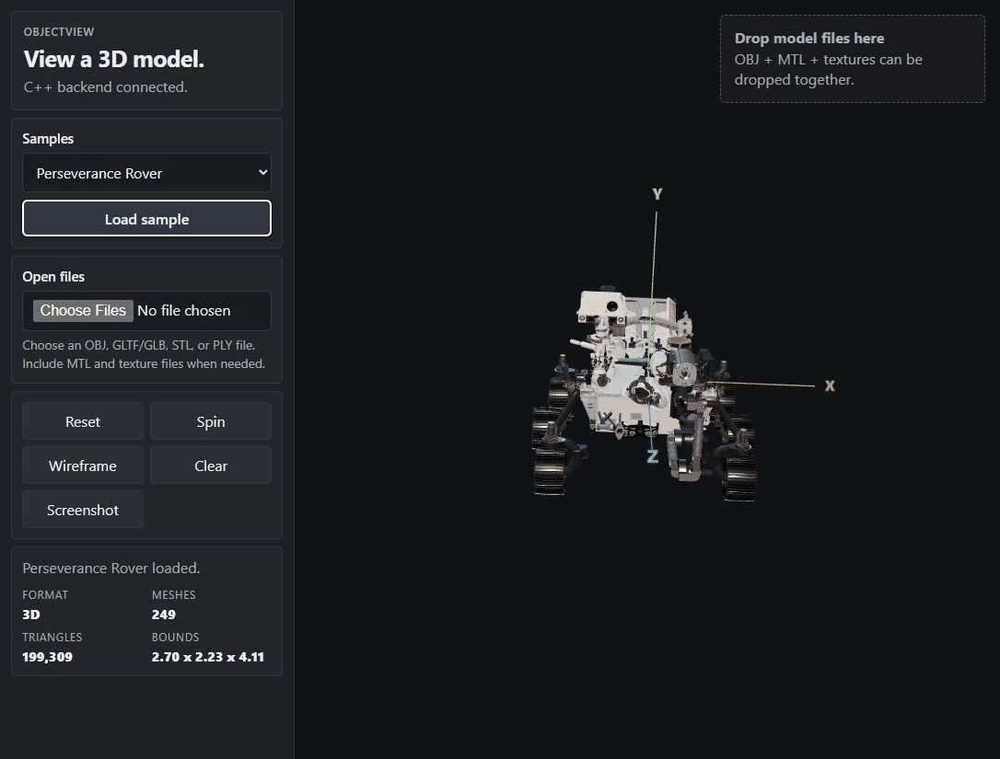
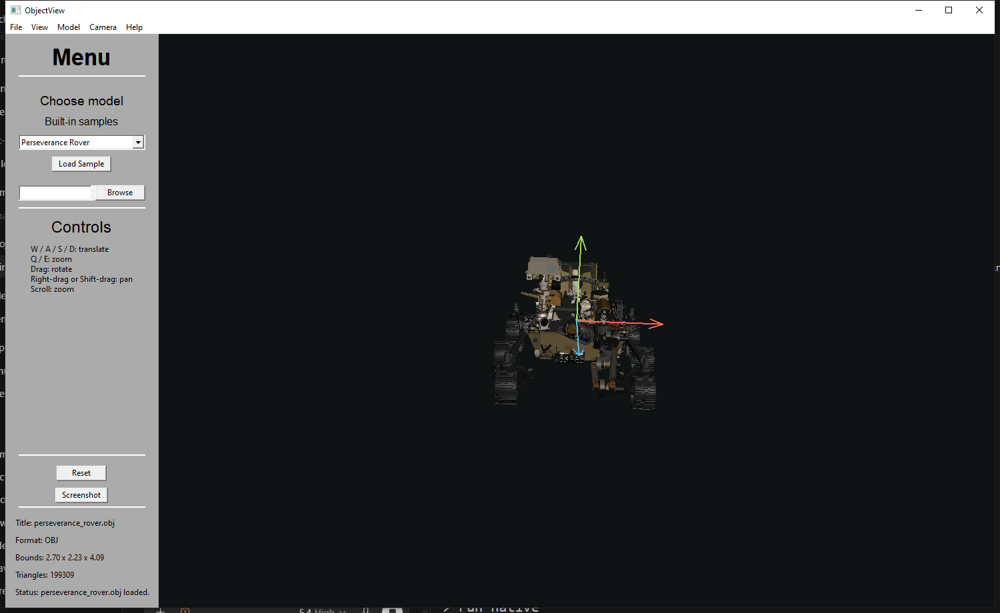
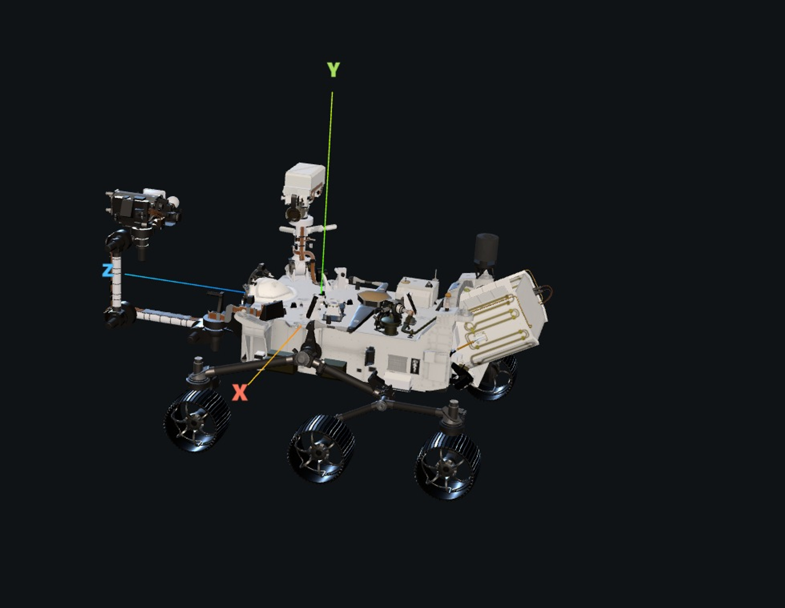

# `object-view`

```text
> load a model
> inspect it
> use native or web
```

A compact 3D model viewer with:

- a native `wxWidgets` + `OpenGL` desktop app
- a browser viewer built with `Three.js`, running entirely client-side
- an optional small `C++` backend for self-hosting the web build

**Live demo:** <https://edwardglockner.github.io/Object-View/>

<p align="center">
  
</p>

## `> overview`

`object-view` is a generic viewer project focused on simple local model inspection with a native desktop app and a matching web surface.

- native viewer opens `OBJ`
- web viewer opens `OBJ`, `GLTF/GLB`, `STL`, and `PLY`
- built-in samples in both viewers
- centered model loading with a local coordinate triad
- drag, pan, zoom, translate, wireframe, and screenshots

## `> quick start`

```bash
cd web
npm install
npm run build

cd ..
cmake -S . -B build
cmake --build build
```

## `> run native`



```bash
./build/object-view-native
```

Windows:

```powershell
.\build\Debug\object-view-native.exe
```

## `> run web`



The web viewer is fully client-side and needs no backend:

```bash
cd web
npm run dev
```

Then open:

```text
http://127.0.0.1:5173
```

For a production build served locally:

```bash
cd web
npm run build
npm run preview
```

Optional: `./build/object-view` also serves the built web app over HTTP,
if you built the C++ backend above and want to self-host it that way.

## `> controls`

Native:

- drag to rotate
- right-drag or shift-drag to pan
- scroll to zoom
- `W A S D` to translate
- `Q / E` to zoom out / in
- `R` to reset
- `F` to toggle wireframe
- `Space` to toggle auto-rotate

Web:

- drag to rotate
- right-drag or shift-drag to pan
- scroll to zoom
- `W A S D` to move
- `Q / E` to move down / up

## `> sample credit`

The default bundled rover sample is NASA's Perseverance rover 3D model.

- Source: <https://science.nasa.gov/resource/mars-perseverance-rover-3d-model/>
- Credit: `NASA / JPL-Caltech`
