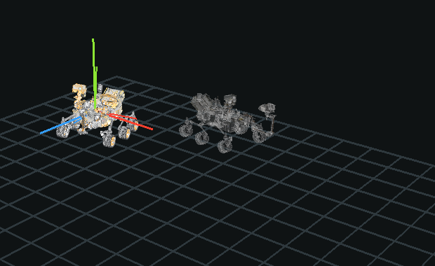
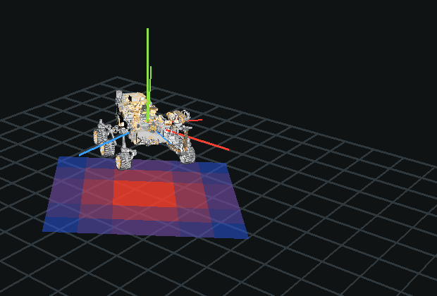
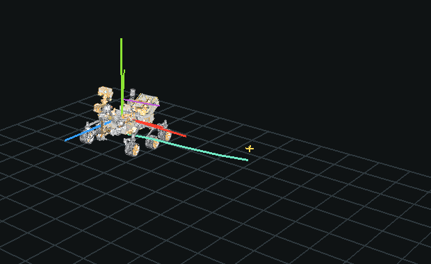

# ObjectView

ObjectView is a small 3D model viewer with both a native C++ OpenGL viewer and a browser-based WebGL viewer. It keeps the general model-loading and visualization ideas from an earlier C++ visualizer, but removes the serial parsing, sensor filtering, plotting, and hardware-specific code.

The native viewer renders OBJ geometry, materials, lighting, axes, camera controls, and simple texture-backed materials directly with C++ and OpenGL. The web layer renders common 3D formats in the browser with Three.js/WebGL.

## What You Can Build With It

Beyond viewing a single model, the scene format (see [`docs/SCENE_FORMAT.md`](docs/SCENE_FORMAT.md)) adds a few generic primitives for building richer visualizations on top of a model:

**Compare two states of the same object.** A "ghost" renders a translucent second copy of an object at another position — before/after, predicted vs. actual, or a design alternative, shown side by side with the real one.



**Paint a value onto the ground.** A heatmap plane colors a grid of ground tiles from any numeric data you provide — elevation, coverage, risk, popularity, whatever your values mean.



**Annotate trajectories and points of interest.** Paths draw a route through space, vectors show a direction, and markers flag a point of interest — the basic vocabulary for describing motion and spatial relationships.



**Animate objects over time.** Objects can move along keyframes with a Play/Pause button and scrub bar in the viewer — run `./build/object-view-native native/scenes/scene-demo.json` and press Play to see it live.

Try any of these yourself:

```bash
./build/object-view-native native/scenes/showcase-ghost.json
./build/object-view-native native/scenes/showcase-heatmap.json
./build/object-view-native native/scenes/showcase-paths.json
./build/object-view-native native/scenes/showcase-playback.json
```

## What It Does

- Provides a native C++ OpenGL executable for desktop rendering.
- Provides a WebGL browser viewer built with Three.js.
- Opens OBJ files in the native viewer.
- Opens generic ObjectView scene JSON files in the native viewer.
- Opens OBJ, GLTF/GLB, STL, and PLY files in the browser.
- Supports OBJ material files in both viewers.
- Bundles the official NASA Perseverance rover model as the default sample.
- Centers and scales models automatically on load.
- Shows global and model-relative XYZ axes.
- Lets you rotate, move, zoom, spin, and toggle wireframe rendering.
- Animates scene objects along keyframes with play/pause and a scrub bar.
- Renders translucent ghost duplicates of scene objects at alternate transforms.
- Renders directional vector arrows and floor heatmap planes for density/value overlays.
- Shows an on-screen legend identifying every element type in a loaded scene.
- Uses the C++ backend to inspect OBJ files and return geometry stats.

## Project Structure

```text
backend/
  include/       C++ model data structures
  src/           C++ OBJ parser and HTTP server
native/
  src/           Native OpenGL desktop viewer
  scenes/        Example scene JSON files
  samples/       Native OpenGL sample models, including the Perseverance rover OBJ
docs/
  SCENE_FORMAT.md Neutral scene JSON format for downstream tools
web/
  public/        Built-in sample models
  src/           Three.js/WebGL frontend
CMakeLists.txt   C++ build entry
```

## Requirements

- CMake 3.20+
- A C++17 compiler
- OpenGL
- Node.js 20+ for the web layer
- GDI+ on Windows for native JPEG/PNG texture loading

## Run Locally

Install the web dependencies:

```bash
cd web
npm install
```

Build the web app:

```bash
npm run build
```

Build the C++ targets from the project root:

```bash
cmake -S . -B build
cmake --build build
```

Run the native C++ OpenGL viewer:

```bash
./build/object-view-native
```

Run the C++ web backend:

```bash
./build/object-view
```

On Windows, the executables are usually:

```powershell
.\build\Debug\object-view-native.exe
.\build\Debug\object-view.exe
```

The native OpenGL viewer accepts an optional OBJ path:

```bash
./build/object-view-native path/to/model.obj
```

It also accepts an ObjectView scene JSON file:

```bash
./build/object-view-native native/scenes/scene-demo.json
```

By default, the native viewer opens the same Perseverance rover sample used by the web app. The browser loads the original GLB, while the native viewer loads an OBJ/MTL conversion with extracted texture files.

If you run the web backend, open:

```text
http://127.0.0.1:8080
```

For WebGL frontend development, run Vite from `web/`:

```bash
npm run dev
```

If the C++ backend is also running on port `8080`, Vite proxies `/api` calls to it.

## Controls

Native OpenGL viewer:

- Drag: rotate the model.
- Right-drag or shift-drag: pan.
- Scroll: zoom in and out.
- WASD: move the model on the X/Z plane.
- Q/E: move down/up.
- Click the left pane buttons for reset, spin, wireframe, and clear/show.
- Click Screenshot or press P to save the native window to `screenshots/`.
- Toggle Detail to add a colored technical edge overlay for distant readability.
- Hold Space: spin.
- Hold F: wireframe.
- R: reset the view.
- When a loaded scene has keyframed objects, a Play/Pause button and scrub bar appear at the bottom of the panel.

WebGL viewer:

- Drag: rotate the model.
- Shift-drag or right-drag: move the model in screen space.
- Scroll: zoom in and out.
- WASD: move on the X/Z plane.
- Q/E: move down/up.
- Click Screenshot to download a PNG of the current canvas.

## Notes

The earlier internal project included hardware parsing and data monitoring pieces. Those are intentionally not included here. ObjectView is focused on the reusable model-viewing part: load a model, inspect it, and view it cleanly.

The browser app uses WebGL because normal web pages cannot create native desktop OpenGL contexts. The native executable is the C++ OpenGL path.

## Sample Asset License

The default bundled sample is the NASA Perseverance rover 3D model.

- Source: https://science.nasa.gov/resource/mars-perseverance-rover-3d-model/
- Credit: NASA/JPL-Caltech
- NASA 3D Resources describes its downloadable assets as free to download and use. Follow NASA Images and Media Usage Guidelines when publishing or redistributing NASA media.

Craft Racer from Kenney Space Kit and the Khronos Toy Car are retained as smaller web samples.
